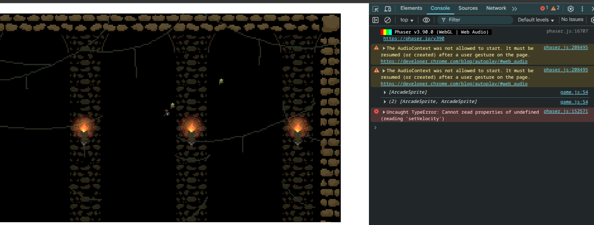

# Entry 3
##### 2/8/26

### Context
Over Winter break I have been learning more on how to use Phaser. I have been learning how to make something happen when two sprites collided with each other. I did this in this [file](../tool/phaser-tinkering2/game.js) where I had a knight and goblin sprite set up. A goblin would spawn every 4 seconds and chase after the knight. My goal was to make it so that when the goblin collided with the knight the knight would be destroyed and the game scene would stop. At first this is what I started with:

```js
this.physics.add.collider(this.goblin, this.knight);
```

This code was inside of a loop that would repeat every 4 seconds to spawn a goblin so it would add collision between the new goblin and the knight every times a new goblin spawned. To find out how to delete the knight when they collided I searched the [Phaser documentation](https://docs.phaser.io/api-documentation/api-documentation) for how to destroy a sprite and found the code `.destroy()` which would destory a sprite when I put the sprite name infront. Next I had to give my collider a callback in the form of a function which would run when a collsion happened between a goblin and the knight. I created a function and put `this.knight.destroy()` inside of it to destory the knight. This is what the code looked like:

```js
function destroyknight() {
    this.knight.destroy();
}
this.physics.add.collider(this.goblin, this.knight, destroyknight, null, this);
```

When I ran it and the knight and goblin collided, I got this error:

I didn't know why and checked my code but didn't find anything wrong. After I while I decided to ask Claude Ai why it was broken. It told me that when they collided and my knight sprite was deleted, my animations for the sprite were still tring to run but couldn't find the sprite so it gave me an error. I fixed this by ending the game scene with this code:

```js
if (this.knight.active == false) {
    alert("game over");
    this.scene.stop('GameScene');
}
```

This code inside the update section would cnostantly test if the knight existed or was destroyed and would give the alert that the game was over and end the game. I ran it and got another error. I was wondering why when I realized that it was the same error from before which meant that the code below the if statement was still running after I stopped the scene so I added `return` to end the update function. This is that it looked like in the end:

```js
if (this.knight.active == false) {
    alert("game over");
    this.scene.stop('GameScene');
    return;
}
```

### EDP
Currently I think that I am on the second stage of the engineering design process which is researching because I have not started my game and I am still tinkering with code and familiarizing myself with Phaser. I think that I will be able to move to the next stage soon because I have learned a lot about Phaser but I can still learn a little more.

### Skills

I think that I have grown in the skills of debugging and attention to detail because when I am tinkering, I find myself getting a lot of errors. Sometimes they are small spelling mistakes but sometimes they are an entire line of code so I have to look through my code carefully and try to find bugs or even an extra letter that appears. For example when using Phaser I use `this.` infront of my sprites to use them in the create and update sections but sometimes I for get to add it and it gives me an error because Phaser cannot find my sprite so I have to pay attention to small details like this when I code.

[Previous](entry02.md) | [Next](entry04.md)

[Home](../README.md)
