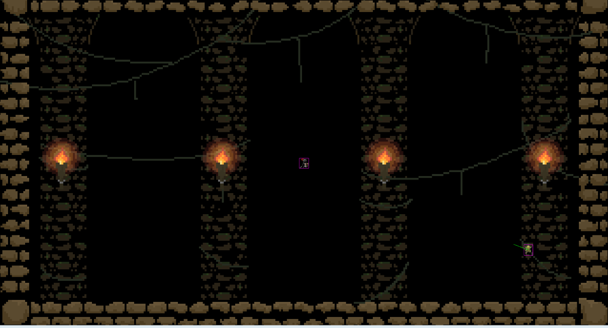

# Entry 4
##### 3/13/26

A few weeks ago I started my freedom project and I have begun to make my game. I have transfered my code from phaser tinkering file 2. Inside of it, I have created a background, a player controlled knight, a loop that spawns attacking goblins, and collision. This is what my game looks like so far:



Currently I have been working on how to make my knight fight against back against the goblins. I have decided on giving him a slash attack and an animation. First I decided to search for a slash sprite sheet and found this one that I liked:


I put this sprite sheet through this [website](leshylabs.com/apps/sstool/) to turn it into a group of sprites and added it into my js file with this code:

```js
this.load.atlas('slash', 'assets/slashSpriteSheet.png', 'assets/slashSprites.json');
```

and this code to add the attack animation:

```js
this.anims.create({ key:'attack', frames: this.anims.generateFrameNames('slash', {prefix:'slash', end: 9, zeroPad:1}), repeat: 0});
```

Next I had to find a way to link this attack to my knight. At first I tried playing my slash animation on the knight but when I ran it I got an error. I realized that I was because I needed to create a new sprite for the slash to be animated. I created it and gave it the animation so that when I clicked it would play the animation and it worked. A problem with it was was that the slash was still there after the animation was done so it looked kind of done. I fixed this by deleting the slash each time it was done with the animation and creating it when I clicked. This way it would be deleted after I clicked and the animation was played, this is what my code looked like:

```js
this.input.on('pointerdown', function (pointer) {
    this.slash = this.physics.add.sprite(this.knight.x, this.knight.y, 'slash');
    this.slash.scale=1.3;  // makes the slash 3 times bigger than original
    this.slash.anims.play('attack', true);
    this.time.addEvent({
        delay: 350,
        callback: () => {
            this.slash.setVisible(false)
            this.slash.destroy()
        },
    });
})
```

I played around with this for a while but realized that I could not hit any goblins. I tried making a loop and inside I created a function that would delete a goblin for each goblin that was spawned and also a so that when it was ran it would make collider between each goblin and the slash. This did not work though, but I had no idea how to fix it even after a long time so I decided to ask Ai to debug it for me and it told me that the reason that it was not working was because I could not use `this.goblinArray` inside of the function because the `this.` would refer to the function instead of the goblin array so I had to use a arrow function. This is what that looked like:

```js
for (let b = 0; b < this.goblinArray.length; b++){
    const destroygoblin = (slashHitbox, goblin) => {
        goblin.destroy(); // if a goblin gets hit by a slash it gets destroyed
        var index = this.goblinArray.indexOf(goblin) // finds the index of the goblin that is hit by a slash
        this.goblinArray.splice(index, 1) // removes the goblin sprite from the goblin array
        console.log("hit")
    }
        this.physics.add.collider(this.slashHitbox, this.goblinArray[b], destroygoblin, null, this) // adds collision between the slash and all goblins
}
```

This worked and killed the goblins when they were in the collision area of my slash.


### EDP

I think that I am on the 5th stage of the Engineering Design Process right now because I have started to make my freedom project and have finished planing my goals for this project. I am also not at step 6 because I am still working on my MVP and I am not ready to test it and improve yet. Right now I still have a few things to work on before I get to testing like an end screen and a timer. I still have to fix some of the animations to face other directions. Soon I can begin to make small adjustments to improve the small details and the bugs that appear.

### Skills

I think that I have grown in the skills of debugging and attention to detail because as I code my project, I find myself getting a lot of errors and bugs. Sometimes they are small spelling mistakes but sometimes I completly thought of a concept in the wrong way like `.active` when I thought that it worked on variables but it only worked on sprites. This means that I have to look through my code carefully and try to find bugs or even an extra letter that appears. For example when I am coding large projects, I sometimes forget that I changes a variable name and I get an error that it does not exist and I have gotten better at checking these things and fixing them when something goes wrong.

[Previous](entry03.md) | [Next](entry05.md)

[Home](../README.md)
