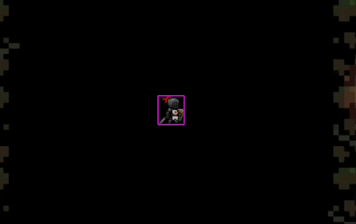

# Entry 5
##### 4/13/26

### Context

I have worked on the MVP for my freedom project for the past few week and I have just finished it. I added a few things and fixed some bugs, like the problem with the hitboxes and I added an increasing difficulty. I learned new code in Phaser like `.visible` annd `debug: true` which helped me debug. When I tested the game I saw that when I clicked, my attack was going through goblins and not killing them half of the time. I looked through my code and guessed that the hitboxes were off. I searched how to see the hitboxes of my sprites and found that if I put `debug:true` in the physics part of my game configuration, It would let me see the hitboxes of my knight's attack. This is what that looked like:



You can see that the hitboxes for my attack were completly off so I decided to make a new hitbox for the slash with a black square that would be invisible but would delete any goblins inside of it. First I took a screenshot of a black screen with equal length and width and added it to my assets folder with the name `slashAttackHitbox.png`. Then I loaded the iamge into my file with this code:

```js
this.load.image('slashHitbox', 'assets/slashAttackHitbox.png');
```

Next I would need to make it so that when I click, the slash hitbox will appear and delete everything in it's range, then delete itself after the slash animation is done. Luckily I already made one for my slash animation so I can just add it too my code. I added the hitbox as a sprite, made it invisible, annd scaled it to fit the slash animation. Then I set it to be destroyed after 0.35 seconds when the animtion finished. I tested my game and it worked, the slash was hitting the goblins in it's area. This was the code for my attack after adding the hitbox in:

```js
this.input.on('pointerdown', function () {
    console.log("clicked")
    console.log(this.goblinArray.length)
    if(this.slashExist == false) {
        this.slashHitbox = this.physics.add.sprite(this.knight.x, this.knight.y, 'slashHitbox'); // makes hotbox of the slash attack
        this.slashHitbox.visible = false; // makes it invisible
        this.slashHitbox.scale = 1.7; // sets how big it should be

        this.slash = this.physics.add.sprite(this.knight.x, this.knight.y, 'slash'); // creates the slash sprite on the knight sprite
        this.slash.scale=1.5;  // makes the slash 1.5 times bigger than original
        this.slash.anims.play('attack', true); // plays animations when there is a click
        this.slashExist = true

        for (let b = 0; b < this.goblinArray.length; b++){
            const destroygoblin = (slashHitbox, goblin) => {
                goblin.destroy(); // if a goblin gets hit by a slash it gets destroyed
                var index = this.goblinArray.indexOf(goblin) // finds the index of the goblin that is hit by a slash
                this.goblinArray.splice(index, 1) // removes the goblin sprite from the goblin array
            }
            this.physics.add.collider(this.slashHitbox, this.goblinArray[b], destroygoblin, null, this); // adds collision between the slash and all goblins
        }

        // 0.35 seconds after I click the attack animation will end and the slash will be deleted.
        this.time.addEvent({
            delay: 350,
            callback: () => {
                this.slashExist = false
                this.slash.destroy() // destorys the slash
                this.slashHitbox.destroy() // destorys the hitbox

                // testing
                console.log(this.slashExist)
            },
        });
    } else {console.log("cooldown")} // tells me when the attack is on cooldown
}, this);
```

Next I wanted to add an increasing difficulty but I wasn't sure on what to do to make it harder so I decided to make it so that for every 5 goblins that were spawned, the spawn rate increases by 10%. My goblin spawner is made with `time.addEvent()` which allows me to add a delay so I created a variable that I could plug in called delaySpeed. Then I set it equal to 4000 which is 4 seconds so now my goblin spawner would spawn goblins every 4 seconds. Next I created another variable called goblinSpawned which would count how many goblins have been spawned. Then I used this code to increase the spawn rate by 10% every 5 goblins:

```js
if(goblinSpawned%5 == 0){ // every 5 seconds, speed up goblin spawn rate by 10%
    delaySpeed = delaySpeed * (0.9);
}
```

This was the entire code:

```js
var delaySpeed = 4000
var goblinSpawned = 0
this.goblinArray = []
this.time.addEvent({
    delay: delaySpeed,
    callback: () => {
        goblinSpawned++;
        if(goblinSpawned%5 == 0){ // every 5 seconds, speed up goblin spawn rate by 10%
            delaySpeed = delaySpeed * (0.9);
        }

        this.goblin = this.physics.add.sprite(Math.random()*(backgroundImage.width), Math.random()*(backgroundImage.height), 'goblin'); // creates the goblin at a random place
        function destroyknight() {
            this.knight.destroy(); // if the knight hits a goblin the knight gets destroyed
        }

        this.physics.add.collider(this.goblin, this.knight, destroyknight, null, this); // adds collison between goblin and knight
        this.goblinArray.push(this.goblin);

        for (let a = 0; a < this.goblinArray.length; a++){
            this.physics.add.collider(this.goblinArray[a], this.goblin); // adds collison for every goblin
        }
        this.goblin.setCollideWorldBounds(true); // stops the goblin from leaving the map
        console.log(this.goblinArray); // testing
        console.log(delaySpeed); // testing
        console.log(goblinSpawned); // testing
    },
    loop: true
});
```

This is the link to my freedom project: [https://ryanl7989.github.io/sep11-freedom-project/](https://ryanl7989.github.io/sep11-freedom-project/)

### EDP

Currently I am on the 6th step of the Engineering Design Process, testing the prototype. I have finished my MVP and I am looking for ways to improve my freedom project or for bugs. There a few bugs that I have found but I am still testing my code to see an potential problems. I am also thinking of some things that I could add, like ranged enemies or a replay system. The next step for me is to improve my game. I think that I still have a bit of time to add some finishing touches so I will work on fixing the bugs that I have before adding anything new to my game.

### Skills

## Time Management

I have improved in time management because for these last few days I have had to balance working on completing my MVP for my freedom project, studying for my 2 ap test in early May, studying for the SAT, and also playing volleyball for the school team. It has been hard to balance everything but I have realized that I need to sacrifice some things to be able to do everything at once so I have stopped playing video games as much at home to make up time to work on different assignments and studying.

## Problem Decomposition

I have improved in problem decomposition because as I code with phaser as seen above, there are massive chunks of code and when I need to implement something new like the slash hitbox that I added, I needed to change multiple parts of my code that were bugged because of a small change. I have also needed to plan what I am going to do first because if I go in blind, then I will only confuse myself with what I need to add or what I already have.

[Previous](entry04.md) | [Next](entry06.md)

[Home](../README.md)
